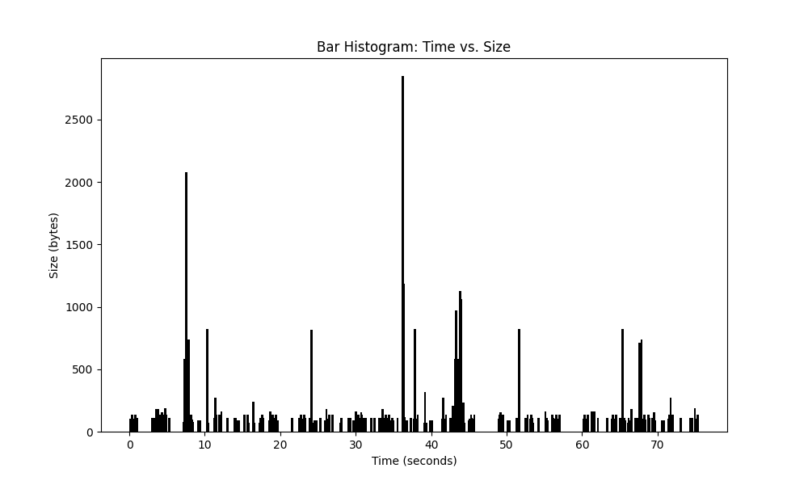
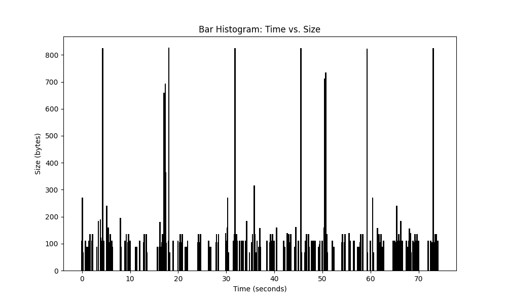
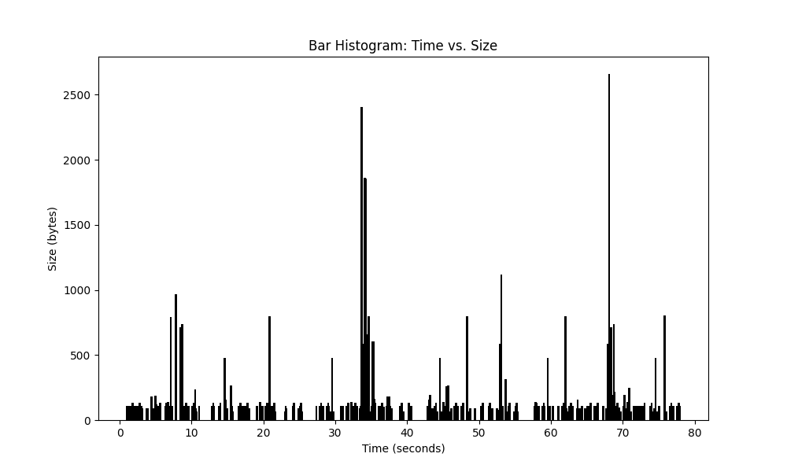
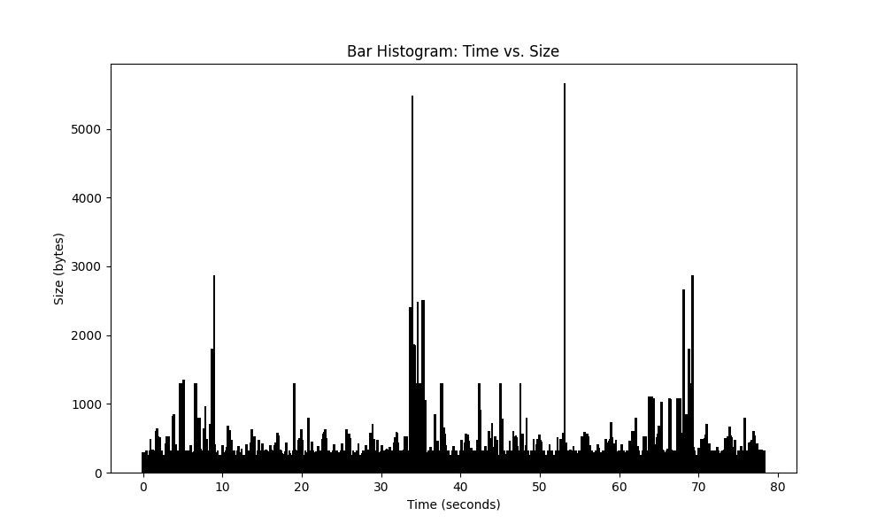
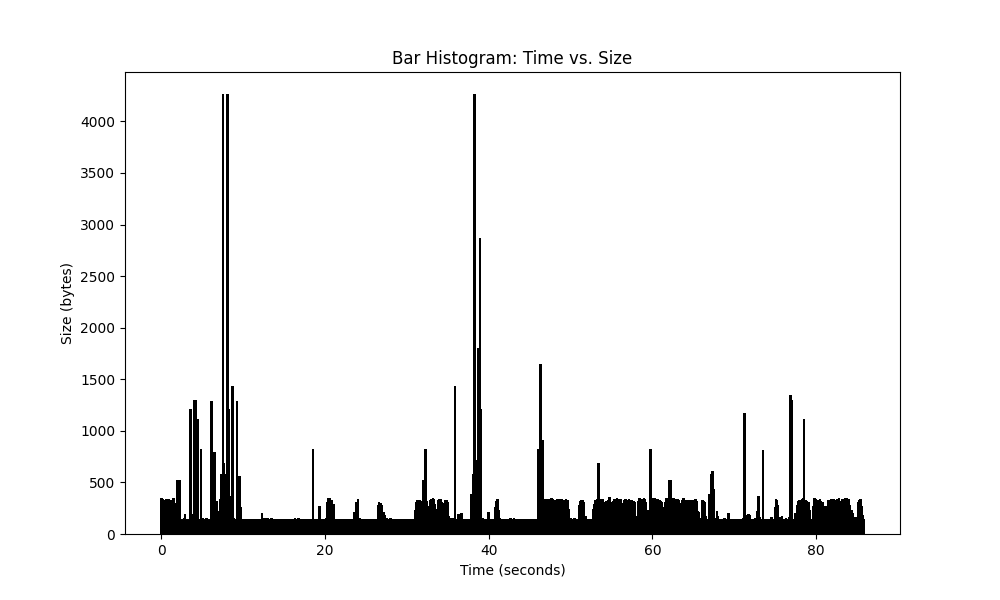
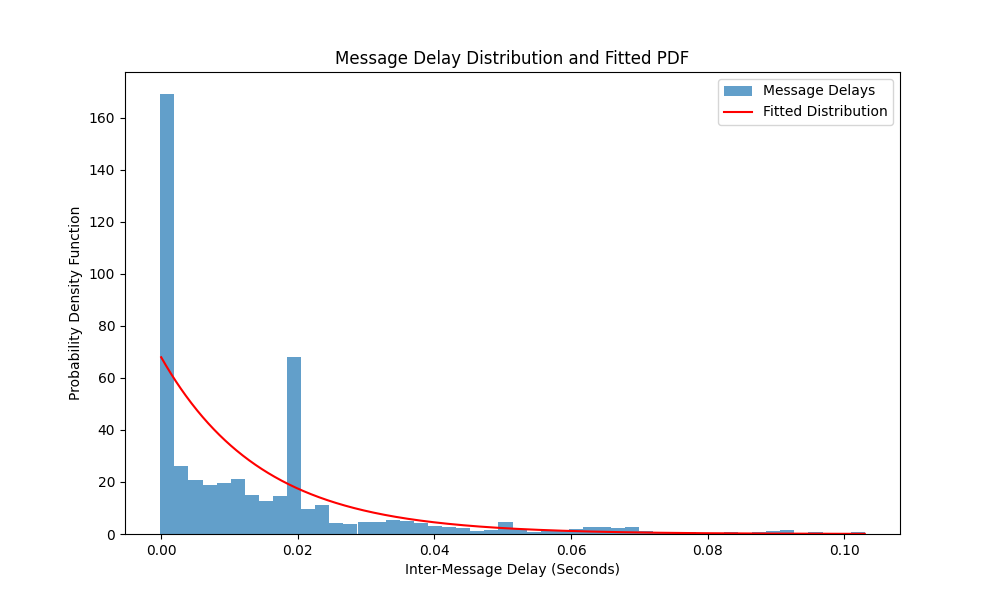
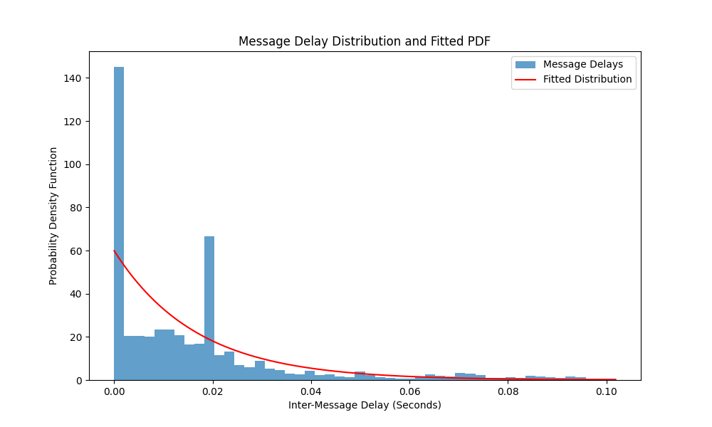
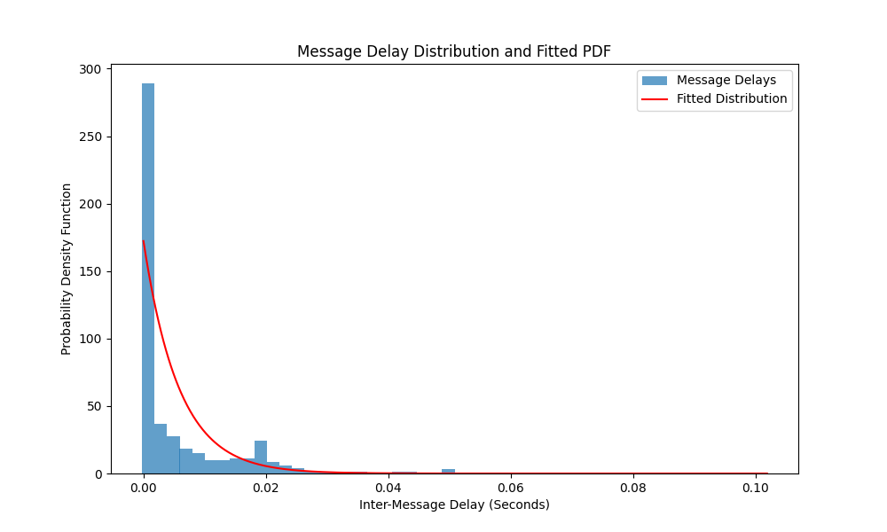
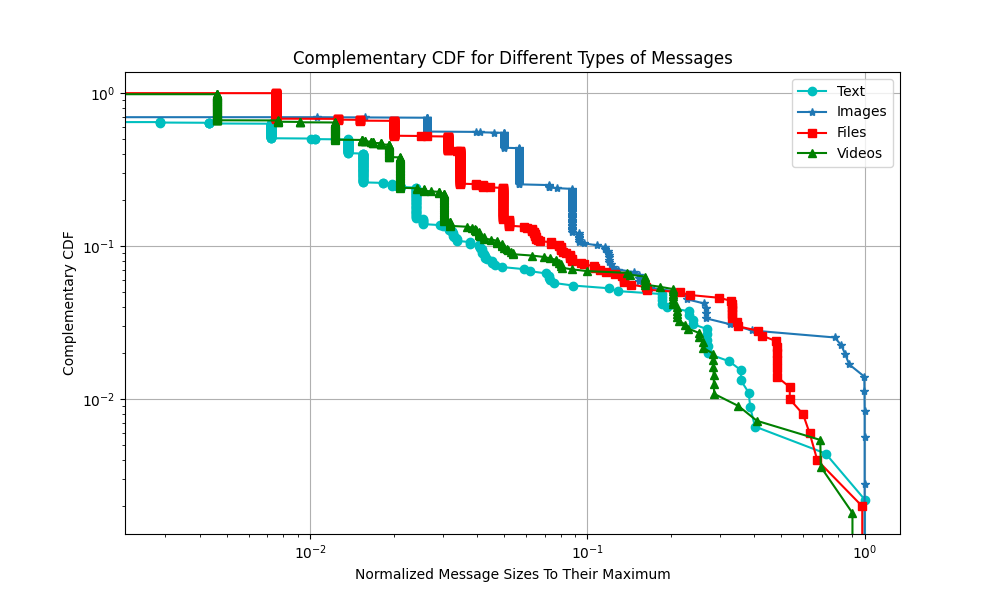
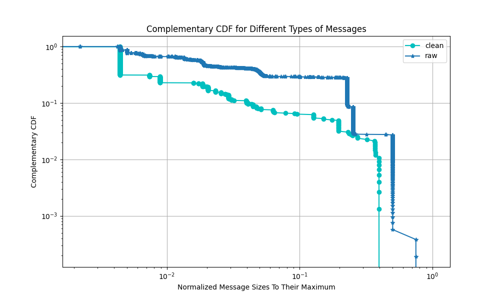

# IM App Traffic Analysis Project

Welcome to the IM App Traffic Analysis Project! This project aims to delve into the world of Instant Messaging (IM)
apps, exploring their traffic patterns to uncover potential security vulnerabilities and privacy concerns. Our goal is
to provide valuable insights into the security landscape of these apps, ultimately contributing to a safer digital
communication environment.

## Project Overview

In this project, we analyze data collected from various IM apps to examine their traffic behavior. We investigate
whether the perceived security of these apps aligns with the actual security measures in place. By studying the patterns
and interactions within the traffic, we aim to raise awareness about potential privacy risks and vulnerabilities that
might compromise user data.

## Key Features

- Data Collection: Gather traffic data from a diverse range of IM apps.
- Traffic Analysis: Thoroughly analyze traffic patterns, encryption protocols, and security measures.
- Vulnerability Identification: Identify potential security vulnerabilities and privacy risks.
- Insights and Findings: Share insights and findings with the community through documentation and reports.

## Getting Started
### Basic Instractions
<ol class="getting-started-list">
    <li>Clone the repository:
        <pre><code class="language-sh">git clone https://github.com/LielYoash/NetworksFInalProject.git</code></pre>
    </li>
    <li>Installation:
        <ul>
            <li><strong>Install Wireshark:</strong> Download and install Wireshark from <a href="https://www.wireshark.org/" target="_blank">wireshark.org</a>.</li>
            <li><strong>Install Python Interpreter:</strong> If not already installed, get Python from <a href="https://www.python.org/" target="_blank">python.org</a>.</li> preferably Python version 10
        </ul>
    </li>
<li>Data Collection:
        <ul>
            <li>Open Wireshark and start capturing network traffic.</li>
            <li>Use relevant filters to capture traffic from the IM apps you want to analyze.</li>
        </ul>
    </li>
    <li>Analysis:
        <ul>
            <li>Review captured data using Wireshark to identify relevant packets.</li>
            <li>Utilize Python scripts in this repository to process captured data:</li>
            Choose one out of the 3 paths:
                <ul>
                <li>Export a size by time graph</li>
                <li>Export a PDF graph</li>
                <li>Export a CCDF graph</li>
                </ul>
        <li>Run the program.</li>
       </ul>
    </li>
    <li>Results:
        <ul>
            <li>Visualize findings and insights from the analysis using graphs and charts.</li>
            <li>Document your observations and conclusions in reports or documentation.</li>
        </ul>
    </li>
</ol>

## Findings

**Data Capture**: We captured network packets from various WhatsApp groups, categorizing them into text messages, image messages, audio & file messages, and video messages.

**Filtering Approach**: To enhance our analysis, we applied the "tcp.dstport == 443" filter in Wireshark, isolating packets associated with HTTPS traffic.
Now we will show you how the data looked with the filters:

### Text Messages

- **Filtered Data:**
  
  
- **Raw Data:**
  

#### Observation:
By applying the filter, the interference from network noise is significantly reduced, enabling clearer visualization of the text messages. Despite the presence of noise, the messages remain distinguishable and understandable in the graphs.

### Image Messages

- **Filtered Data:**
  
  
- **Raw Data:**
  

#### Observation:
The filter enhances the visualization of image messages, highlighting the shared visual content while minimizing network disturbances. Even in the presence of noise, the images remain discernible in the graphs.

### Audio & File Messages

- **Filtered Data:**
  
  
- **Raw Data:**
  

#### Observation:
Filtering out unwanted noise significantly improves the clarity of audio and file messages. Despite network interference, the distinct patterns of multimedia sharing are evident in the filtered graphs.

### Video Messages

- **Filtered Data:**
  
  
- **Raw Data:**
  

#### Observation:
The application of the filter enhances the visualization of video messages, making video sharing patterns more prominent. Despite network noise, the filtered graphs offer improved visibility.

### Overall Observation

While the raw data displays interference from network activity, the filtered data showcases the efficacy of the filtering process. Despite noise, the messages remain distinguishable in the graphs.

---

# Probability Density Function (PDF) Analysis

After conducting an in-depth analysis of WhatsApp group data, we embarked on characterizing Inter-Message Delays (IMDs). This phase of the study aimed to uncover insights into the time intervals between messages or message batches sent within the communication channels.

## Gaining Deeper Insight with Probability Density Function (PDF)

In our quest for a profound comprehension of IMDs, we harnessed the power of the Probability Density Function (PDF). This mathematical tool allowed us to visualize the distribution of time intervals and their corresponding probabilities.

## PDF Analysis for Different Message Groups

### Text Only Group

### Video Only Group

### Files and Audio Only Group

### Image Only Group

### Mixed Message Groups

---

The Probability Density Function (PDF) analysis provides valuable insights into the temporal dynamics of message transmissions within different WhatsApp group types. Customize the paths to your PDF images to ensure accurate display in your repository.

# Complementary Cumulative Density Function (CCDF) Analysis

In addition to our Probability Density Function (PDF) analysis, we explored the Complementary Cumulative Density Function (CCDF) of normalized message sizes for different message types. This phase of the study aimed to reveal insights into the distribution of message sizes and their characteristics across various categories.

## Investigating Message Size Distributions with CCDF

To gain a comprehensive understanding of message size distributions, we employed the Complementary Cumulative Density Function (CCDF). This mathematical approach allowed us to analyze the normalized message sizes by scaling them with respect to the maximum message size within each respective category.

### CCDF Analysis for Different Message Types

#### Combination of Filtered Groups

#### Combination of Raw Groups

#### Combined Data from all groups at the same time

---

The Complementary Cumulative Density Function (CCDF) analysis unveils the diversity in message size distributions among various message types. The provided images offer insights into the normalized message sizes within each category and their respective distributions. Ensure the image URLs are accurate to enable proper display in your repository.

## License

This project is licensed under the GNU General Public License v3.0 - see the [LICENSE](LICENSE) file for details.

## Contact

For questions, feedback, or collaboration inquiries, reach out to [Your Name] at [your@email.com].

Thank you for your interest in the IM App Traffic Analysis Project!