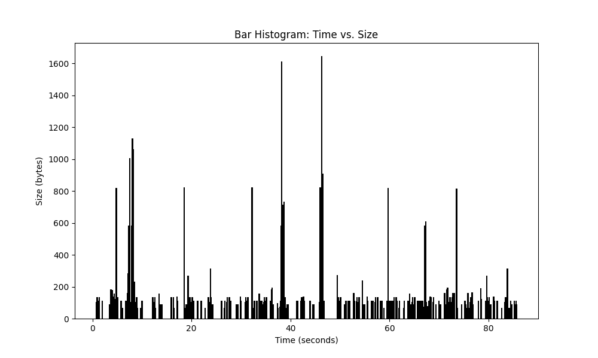
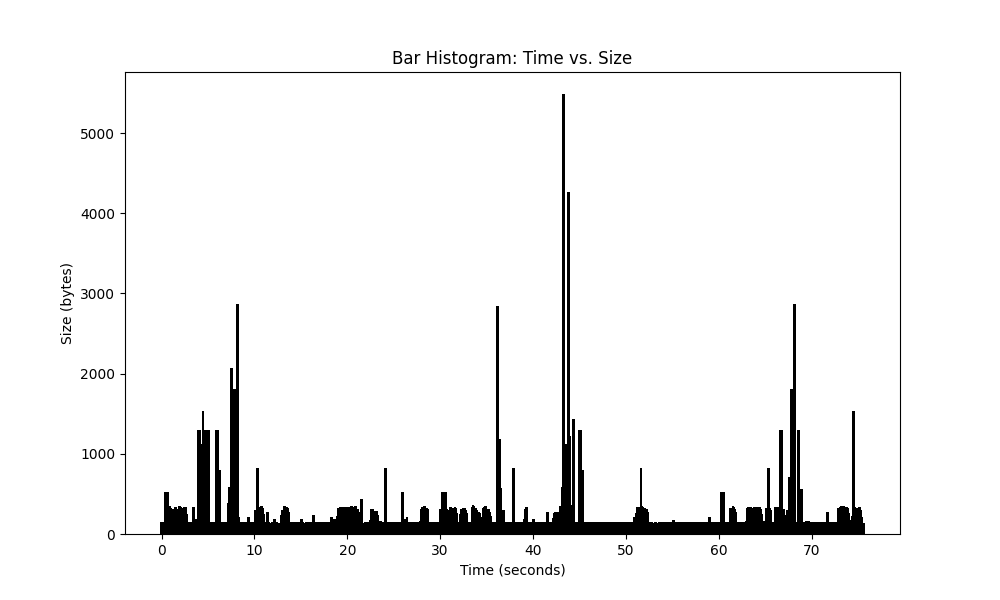

# IM App Traffic Analysis Project

Welcome to the IM App Traffic Analysis Project! This project aims to delve into the world of Instant Messaging (IM)
apps, exploring their traffic patterns to uncover potential security vulnerabilities and privacy concerns. Our goal is
to provide valuable insights into the security landscape of these apps, ultimately contributing to a safer digital
communication environment.

## Project Overview

In this project, we analyze data collected from various IM apps to examine their traffic behavior. We investigate
whether the perceived security of these apps aligns with the actual security measures in place. By studying the patterns
and interactions within the traffic, we aim to raise awareness about potential privacy risks and vulnerabilities that
might compromise user data.

## Key Features

- Data Collection: Gather traffic data from a diverse range of IM apps.
- Traffic Analysis: Thoroughly analyze traffic patterns, encryption protocols, and security measures.
- Vulnerability Identification: Identify potential security vulnerabilities and privacy risks.
- Insights and Findings: Share insights and findings with the community through documentation and reports.

## Getting Started
### Basic Instractions
<ol class="getting-started-list">
    <li>Clone the repository:
        <pre><code class="language-sh">git clone https://github.com/LielYoash/NetworksFInalProject.git</code></pre>
    </li>
    <li>Installation:
        <ul>
            <li><strong>Install Wireshark:</strong> Download and install Wireshark from <a href="https://www.wireshark.org/" target="_blank">wireshark.org</a>.</li>
            <li><strong>Install Python Interpreter:</strong> If not already installed, get Python from <a href="https://www.python.org/" target="_blank">python.org</a>.</li> preferably Python version 10
        </ul>
    </li>
<li>Data Collection:
        <ul>
            <li>Open Wireshark and start capturing network traffic.</li>
            <li>Use relevant filters to capture traffic from the IM apps you want to analyze.</li>
        </ul>
    </li>
    <li>Analysis:
        <ul>
            <li>Review captured data using Wireshark to identify relevant packets.</li>
            <li>Utilize Python scripts in this repository to process captured data:</li>
            Choose one out of the 3 paths:
                <ul>
                <li>Export a size by time graph</li>
                <li>Export a PDF graph</li>
                <li>Export a CCDF graph</li>
                </ul>
        <li>Run the program.</li>
       </ul>
    </li>
    <li>Results:
        <ul>
            <li>Visualize findings and insights from the analysis using graphs and charts.</li>
            <li>Document your observations and conclusions in reports or documentation.</li>
        </ul>
    </li>
</ol>

## Findings

here are the results of our research

Firstly we used Wireshark to sniff the data from four different whatsapp groups seperatly.
1. Text messages only
2. Video messages
3. Picture messages
4. Files and voice messages

we have put the following filter in wireshark tcp.dstport == 443 to display only the network packets that have a destination port of 443 and use the TCP protocol. Port 443 is commonly associated with the HTTPS protocol, which is used to secure web traffic.

Now we will show you how the data looked with the filters:

1. this is the text messages with the filter

2. this is the Image messages with the filter

3. this is the Audio&File messages with the filter

4. this is the Video messages with the filter

You can see the difference from the RAW data without the filteres

1. this is the text messages without the filter

2. this is the Image messages without the filter

3. this is the Audio&File messages without the filter

4. this is the Video messages without the filter

## License

This project is licensed under the GNU General Public License v3.0 - see the [LICENSE](LICENSE) file for details.

## Contact

For questions, feedback, or collaboration inquiries, reach out to [Your Name] at [your@email.com].

Thank you for your interest in the IM App Traffic Analysis Project!